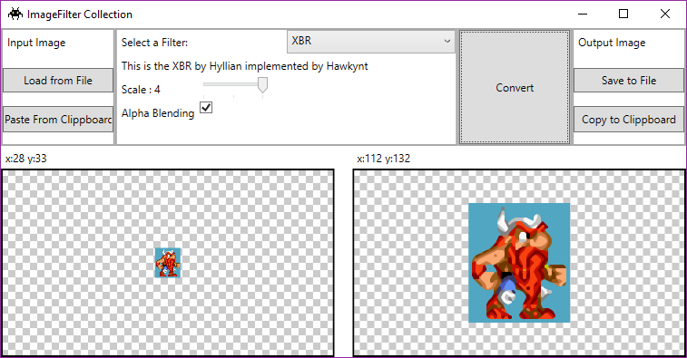

# Image Filter Collection
Collection of Image Filters for Pixel Art resizing. (HQ, XBR, etc)
Based on the 2dImageFilter by Hawkynt: https://github.com/Hawkynt/2dimagefilter

Most likely i made a new gui (WPF) and added the option to use the clipboard as source for the images, and a wrapper to use the filters in any NetStandart2.0 or higher environemt.

It supports PNG files and Clipboard with Alpha channel

# Usage
Its easy, in the top left corner you can provide an image (paste from the clipboard) or load from a PNG file.
Pasting from clipboard has ben tested with Gimp & Paint.Net

Pick a filte in the middle and adjust the settings for it and click on "Convert"

You can save the result to a PNG file or copy the result into the Clipboard on the right side.

# Projects in the Solution
## FilterWrapper (.NetStandard 2.0)
This Project contains a wrapper for the filters that wraps them into an interface that can than be used by other programms that can be .net4 or netCore.
Also a manager that reflects with an Interface and provides a settings system for the filters (they may have individual settings)
It also contains some code from [Hawkynt](https://github.com/Hawkynt) 2dImageFilter (the implementation of some filters) just changed a bit to be NetStandard 2.0 compatible.

## ImageFilter (Wpf application)
a gui app that can make use of all the filters that are Implemented with FilterWrapper.

## Others
There are also 2 console Projects, they was just to test some stuff.

## What i want to do next
+ a special mode for tilesets (work each tile individually to prevent border problems between tiles)
+ a web version that uses the FilterWrapper project (.netCore ASP or maybe for Piranha CMS)
